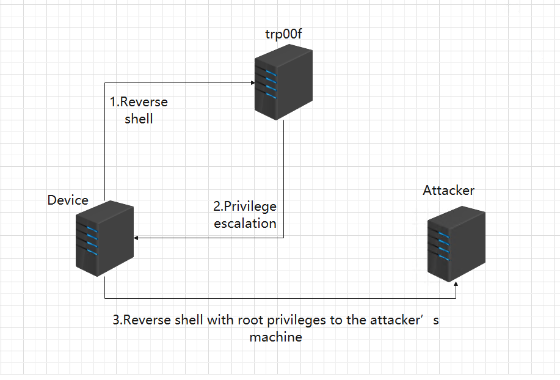
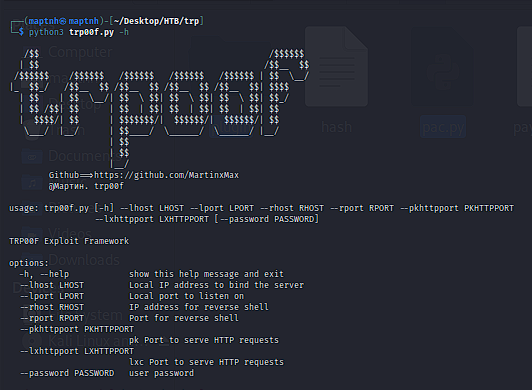
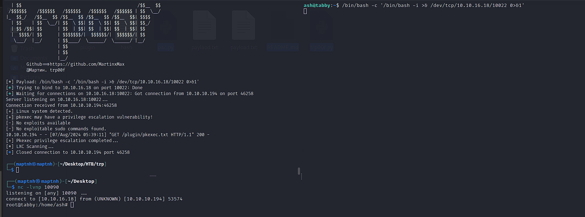

# Update Announcement

**New Features:**
- [+] **Systemctl Privilege Escalation**
- [+] **LXC Privilege Escalation**
- [+] **PKEXEC Privilege Escalation**
- [+] **SUID Auto Privilege Escalation**
- [+] **SUDO Auto Privilege Escalation**

**Improvements:**
- [*] **Merged HTTP Server Ports**
- [*] **Fix the issue where the CURL command fails to escalate privileges.**

# TRP00F

TRP00F is a fully automated Linux privilege escalation machine. The controlled endpoint connects to the privilege escalation machine through a reverse shell, and the privilege escalation machine will automatically elevate privileges to the specified attacker's machine.

trp00f is a tool that is actively maintained and updated, with new features being added over time.

An interesting point is that you can deploy TRP00F on other servers to act as a "peeler." Any host that connects back to TRP00F will have its shell attempted for batch privilege escalation, and the elevated shell will then be connected to the attacker's machine.

## Usage

`$ python3 trp00f.py -h`

## Detect and capture reverse shell

`$ python3 trp00f.py --lhost 10.10.16.18 --lport 10022 --rhost 10.10.16.18 --rport 10090 --pkhttpport 10033 --lxhttpport 10091 --password 'admin@it'`

If the host password is uncertain, the password field does not need to be added.

Copy the payload to the target machine, execute it, and connect to our privilege escalation machine.

